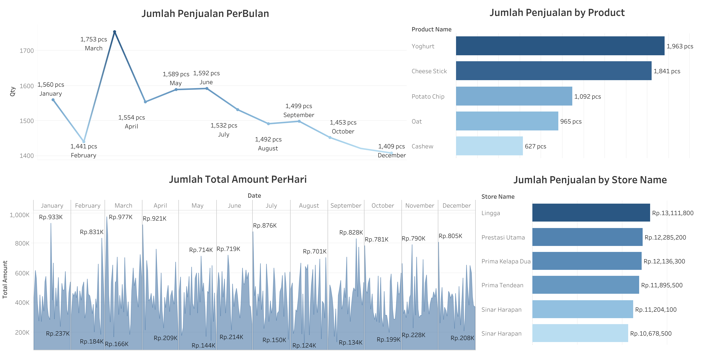

# Customer Segmentation Dashboard for Kalbe Nutritionals

This repository contains the project for building a Customer Segmentation Dashboard as part of the **Data Scientist Project-Based Internship at Kalbe Nutritionals**. The project combines customer behavior data, product transactions, store performance, and customer demographics to create practical, business-oriented segmentation insights.

## Project Overview

The objective is to turn raw operational data into actionable marketing intelligence:

- Group customers into behavioral segments using transaction patterns.
- Explain what each segment represents through cluster profiles.
- Support targeted decisions for campaign design, retention, and product strategy.
- Expose the results in an interactive dashboard for non-technical stakeholders.

The analysis pipeline in this project follows:

1. Data integration from `Customer`, `Product`, `Store`, and `Transaction` tables.
2. Data cleaning (type conversion, missing value handling, duplicate checks).
3. Feature engineering for customer-level metrics:
   - total transactions per customer,
   - total quantity purchased,
   - total revenue contribution.
4. Customer clustering with K-Means using standardized features.
5. Validation of cluster count with:
   - elbow method,
   - silhouette score comparison for multiple `k`.
6. Segment interpretation and visualization in an interactive dashboard.

### Insight Flow

I tested several cluster options and selected **`k=3`** as the operating segmentation setting after comparing cluster-fit metrics in the same data preparation context.  
This yields three behavioral customer groups that can be interpreted by frequency, volume, and spend intensity.

To support business storytelling, I also added SQL analysis for common management questions:

- Average customer age by `gender`.
- Average customer age by `marital status`.
- Top-performing store by total quantity.
- Top-selling product by total revenue.

## Key Features

- **Preprocessing**: Consolidation and cleaning of multi-table transactional and demographic data.
- **Segmentation Modeling**: K-Means clustering for customer profiling with standardized features.
- **Outlier Awareness**: Numerical outlier check before clustering to avoid distortion.
- **Model Selection**: Elbow and silhouette validation for cluster count rationale.
- **Tableau Dashboard**: Interactive sales dashboard to monitor monthly sales, daily revenue movement, product performance, and store contribution.
- **SQL Analytics**: Additional business queries for management decision support.
- **Business Readout**: Segment-level interpretation that can guide campaign and channel strategy.

## Tech Stack

- **Python**: Data processing, feature engineering, and clustering workflow.
- **Pandas & NumPy**: Data manipulation and numerical operations.
- **Scikit-learn**: StandardScaler and K-Means implementation.
- **Tableau**: Interactive dashboard construction.
- **SQL**: Analytical queries for customer, store, and product insights.
- **Seaborn & Matplotlib**: Pattern exploration, cluster diagnostics, and exploratory visuals.

## Project Structure

```text
Dashboard-Segmentation-Customer-Kalbe-Nutritionals/
├── Dataset/
│   ├── Customer.csv
│   ├── Product.csv
│   ├── Store.csv
│   └── Transaction.csv
├── Python/
│   └── Kalbe/
│       ├── Kalbe Nutritionals.py
│       └── Kalbe_Nutritionals.ipynb
├── SQL/
│   ├── Query 1.sql
│   ├── Query 2.sql
│   ├── Query 3.sql
│   └── Query 4.sql
├── Visualization/
│   └── Dashboard.png
├── Docs/
│   └── FinalTask_Kalbe_DS_Firman Maulana.pdf
└── Video/
    └── Presentasi Kalbe Nutritionals.mp4
```

## Dashboard Preview

The dashboard was created in **Tableau** to help stakeholders quickly monitor sales performance and identify business priorities across product, store, and time dimensions.



### Dashboard Insights

| Area                      | Insight                                                                                                                                                                |
| ------------------------- | ---------------------------------------------------------------------------------------------------------------------------------------------------------------------- |
| Monthly Sales Trend       | Highest sales occurred in **March** with **1,753 pcs**, while the lowest visible monthly sales occurred in **December** with **1,409 pcs**.                            |
| Product Performance       | **Yoghurt** became the top-selling product with **1,963 pcs**, followed by **Cheese Stick** with **1,841 pcs**.                                                        |
| Store Contribution        | **Lingga** generated the highest total amount at **Rp13,111,800**, followed by **Prestasi Utama** at **Rp12,285,200**.                                                 |
| Daily Transaction Pattern | Daily revenue fluctuates sharply, showing several sales spikes close to **Rp900K-Rp977K**, which can be investigated further for campaign, store, or seasonal effects. |

### Business Interpretation

The Tableau dashboard shows that sales are not evenly distributed across time, product, and store. Product demand is concentrated in a small number of high-performing items, especially Yoghurt and Cheese Stick, while store contribution is led by Lingga and several closely competing outlets.

From a business perspective, these insights can support:

- **Inventory Planning**: Prioritize stock availability for high-volume products such as Yoghurt and Cheese Stick.
- **Store Benchmarking**: Use Lingga as a reference point to compare sales execution across stores.
- **Campaign Timing**: Investigate March sales uplift and daily revenue spikes to understand whether they were driven by promotion, seasonality, or customer behavior.
- **Customer Segmentation Follow-up**: Combine dashboard findings with customer clusters to design targeted retention and upsell strategies.

## Notes

- This project emphasizes interpretation and decision utility rather than only model accuracy metrics.
- The Tableau dashboard complements the clustering model by translating analytical output into a stakeholder-friendly business view.
